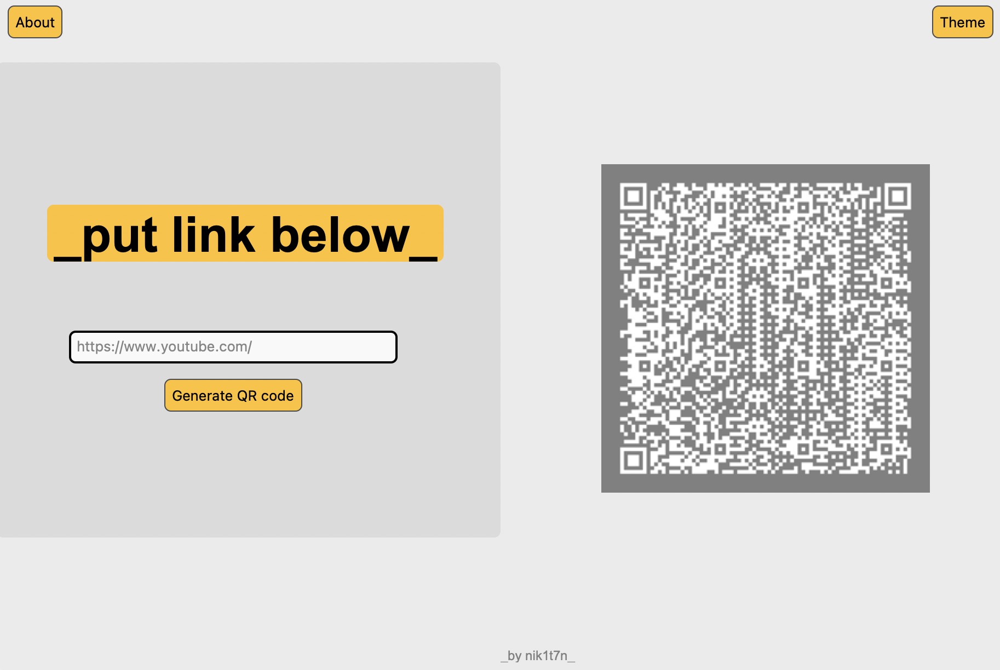
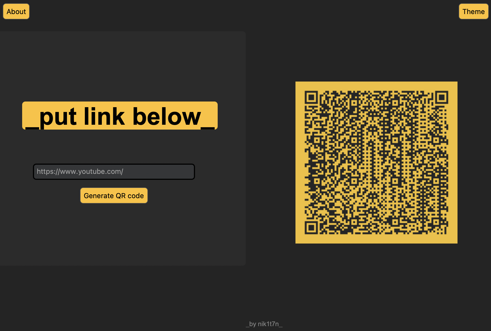

<b>QR Code Generator</b> 

A simple QR code generation app built with customtkinter and qrcode in Python.

<b>Features:</b>
<ul>
    <li>Generate QR codes from entered links</li>
    <li>Light and dark color themes</li>
    <li>Intuitive and modern interface with CustomTkinter</li>
    <li>Popup window with app info</li>
</ul>

<b>Screenshots:</b>
 
 

<b>Usage MacOS:</b>
<ol>
    <li>Clone the repository:</li>
</ol>
<code>git clone https://github.com/Nik1t7n/QRcode</code>

<ol>
     
    <li>Open the directory:</li>
</ol>
<code>cd path/to/QRcode</code>

<ol>
     
    <li>Create a virtual environment:</li>
</ol>
<code>python3 -m venv venv</code>
 <code>source venv/bin/activate</code>

<ol>
     
    <li>Install dependencies:</li>
</ol>
<code>brew install python-tk</code>
 <code>pip install -r requirements.txt</code>

<ol start="2">
     
    <li>Run the app:</li>
</ol>
<code>python3 main.py </code> 

<b> Author:</b>
 
Written by Nik1t7n as a CustomTkinter demo app.

<b>License:</b>
 
This project is licensed under the MIT License.
